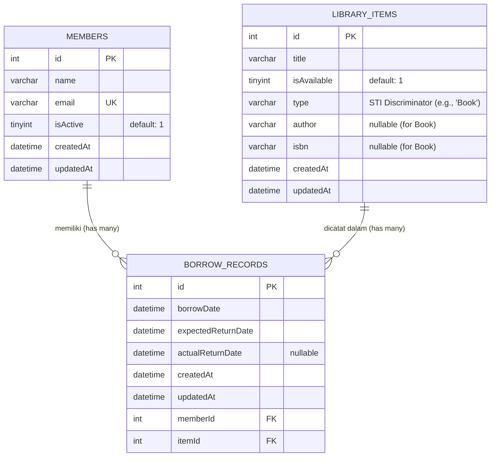

# Database UML Diagram (Entity-Relationship)

Berikut adalah struktur diagram database (ERD) dari sistem Library Management ini. Diagram ini menggunakan sintaks **Mermaid.js** yang dapat dirender secara otomatis dan visual apabila Anda melihat file ini langsung di GitHub atau di *Markdown viewer* modern lainnya.

### Penjelasan Relasi & Arsitektur
1. **MEMBERS (Anggota)**:
   - Tabel ini menyimpan data anggota atau staf.
   - Relasi: Satu Anggota (`MEMBERS`) dapat memiliki banyak catatan peminjaman (`BORROW_RECORDS`). Relasi adalah *One-to-Many*.

2. **LIBRARY_ITEMS (Item Perpustakaan / Buku)**:
   - Tabel ini dirancang menggunakan arsitektur **Single Table Inheritance (STI)** di TypeORM. Semua tipe item (misalnya Buku, Jurnal, DVD) disimpan dalam tabel yang sama. Kolom `type` bertindak sebagai *discriminator* yang membedakan apakah baris data tersebut adalah entitas `Book` atau yang lainnya.
   - Kolom `author` dan `isbn` hanya akan terisi jika tipe item tersebut adalah `Book`.
   - Relasi: Satu item perpustakaan dapat memiliki histori yang panjang yang dicatat dalam banyak `BORROW_RECORDS`. Relasi adalah *One-to-Many*.

3. **BORROW_RECORDS (Catatan Peminjaman)**:
   - Tabel transaksional ini adalah *junction* atau perantara yang menghubungkan `MEMBERS` dan `LIBRARY_ITEMS`.
   - Tabel ini berisi dua *Foreign Key* (kunci tamu) yaitu `memberId` dan `itemId`.
   - Status peminjaman aktif ditandai ketika `actualReturnDate` bernilai `null`.
